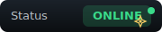
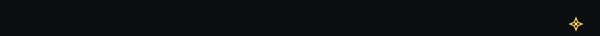

> *the answer was already known before you asked, but only if you knew what to listen for.*

<!-- ========================= HERO ========================= -->
<p align="center">
  
</p>

<h1 align="center">readme-motion</h1>
<p align="center">
  Generate gorgeous, dependency-free <b>animated SVGs</b> for your GitHub README from a tiny JSON file.<br/>
  <i>No server. No build chain. Just commit and use.</i>
</p>

<p align="center">
  <a href="https://github.com/xryv/readme-motion/stargazers"></a>
  <a href="https://github.com/xryv/readme-motion/actions"></a>
  
  
</p>

---

## ✨ Demo Gallery (one-shot showcase)

<!-- Titles + assets neatly centered and shown ONCE -->

<p align="center"><b>Typing Headline</b></p>
<p align="center">
  
</p>

<p align="center"><b>Build Progress</b></p>
<p align="center">
  
</p>

<p align="center"><b>Status Badge</b></p>
<p align="center">
  
</p>

<p align="center"><b>Stars Counter</b></p>
<p align="center">
  
</p>

<p align="center"><b>Commits Sparkline</b></p>
<p align="center">
  
</p>

<p align="center"><b>Now Playing Ticker</b></p>
<p align="center">
  
</p>

---

## 🔧 Why this?
- **Search-friendly** keywords: “README animation”, “typing svg”, “progress badge”.
- **Local-first**: renders static SVGs into `/assets`, works on GitHub instantly.
- **Zero dependencies**: pure Node + inline SVG/SMIL.
- **One config**: describe visuals in `motion.config.json`.

---

## 🚀 Quick start
```bash
# global (optional)
npm i -g readme-motion

# scaffold sample config + themes
readme-motion --init

# generate from config (local or CI)
npx readme-motion --config motion.config.json
# or
node cli/index.js --config motion.config.json
