# readme-motion

> Generate gorgeous, dependency-free animated SVGs for your GitHub README from a tiny JSON file. No server. No build chain. Just commit and use.

https://github.com/xryv/readme-motion

---

## Why?

- **Search-friendly:** “README animation”, “typing svg”, “progress badge”.
- **Local-first:** Renders SVGs into `/assets` – referenced directly in your README.
- **No dependencies:** Pure Node + inline SVG/CSS/SMIL animations.
- **One config:** Describe what you want in `motion.config.json`.

---

## Quick start

```bash
npm i -g readme-motion
# or run locally with: npx readme-motion --config motion.config.json
readme-motion --init           # scaffolds a sample config
readme-motion --config motion.config.json


## New in v0.2.0

- **Themes** via `themes.json` (`dark`, `industrial`, `light`) or per-item colors.
- New generators:
  - `badge` — pulsing status badge (`tone: good|warn|bad`).
  - `counter` — odometer-style number flip (`from`→`to`, `digits`, `durationMs`).
  - `sparkline` — tiny animated line chart from numeric array.
  - `ticker` — marquee “now playing” scroller.
- **Easter egg**: set `"easterEgg": "wizard"` in your root config to get a subtle ✨ sparkle overlay on all generated SVGs.

Run:
```bash
npm run demo





{ "industrial": { "bg":"#0b0e11", "text":"#E8EDF2", "accent":"#00B3FF", "track":"#1a2129", "good":"#3ADB8A", "warn":"#FFCC00", "bad":"#FF4D4F", "muted":"#8B949E" } }


---

## How to test now
```bash
npm i
npm run demo
